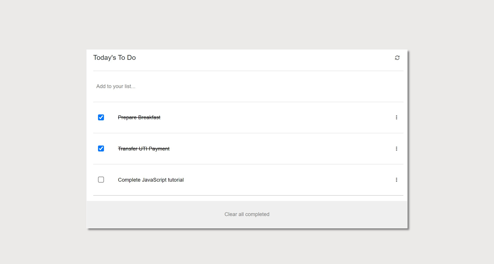

## To-do-list ![To-do-list]

To do list is a task mangement webapp, On page load the dynamically created list of tasks in the dedicated placeholder. The list should appear in order of the index values for each task also implemented the CRUD (create, update, delete) methods.The user will also be able to mark task completion clicking on checkbox and undo it and also can be deleted marked task via ckicking on "clear all completed" button.

## Built With

- HTML & CSS
- JavaScript

## ScreenShot Demo

## Live Demo 
[Live Demo](https://monikasoambyjus.github.io/To-Do-List-ByjusTeachers/)

Getting Started
To get the content of this project locally you need to run this command in your terminal:

[To do list](https://github.com/monikasoambyjus/To-do-list)

👤 **Monika**

- GitHub: [GitHub](https://github.com/monikasoambyjus)
- Twitter: @monikasoam

🤝 **Contributing**

Contributions, issues, and feature requests are welcome!

Feel free to check the [issues page](https://github.com/monikasoambyjus/To-do-list/issues).

## Show your support

Give a ⭐️ if you like this project! and advice me where to work upon it

